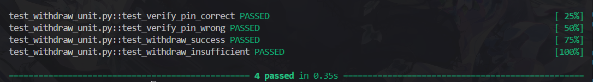
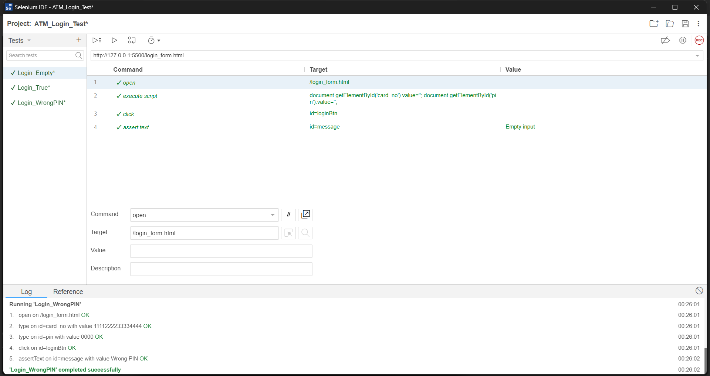

# 🧪 Lab 08 – Kiểm thử ATM (Unit Test & Integration Test)

## 🎯 Mục tiêu
Thực hành kiểm thử module **ATM Withdraw** và **Form Login**:
- Unit test bằng `pytest`
- Integration test bằng `Selenium IDE`

---

## ⚙️ 1. Cấu trúc thư mục

Lab08/
│
├── init_db.py # Khởi tạo CSDL demo
├── withdraw.py # Module rút tiền
├── test_withdraw_unit.py # Unit test (pytest)
├── unit_test_report.txt # Báo cáo pytest
├── login_form.html # Form login giả lập
├── atm_login_test.side # Selenium IDE project
├── screenshot.png # Kết quả Unit Test (pytest)
└── screenshot2.png # Kết quả Integration Test (Selenium IDE)


---

## 🧩 2. Unit Test (pytest)
Chạy lệnh:
```bash
pytest -v | tee unit_test_report.txt

Kết quả:
collected 4 items
4 passed in 0.35s

```
### 📸 Ảnh minh họa kết quả kiểm thử

#### 1️⃣ Unit Test (pytest)

> ✅ Kết quả chạy `pytest -v`: 4/4 test case passed  
> - verify_pin đúng/sai  
> - withdraw đủ tiền/thiếu tiền  

#### 2️⃣ Integration Test (Selenium IDE)

> ✅ Selenium IDE: 3/3 test case passed  
> - Login_True (✅ Login success)  
> - Login_WrongPIN (❌ Wrong PIN)  
> - Login_Empty (⚠️ Empty input)
